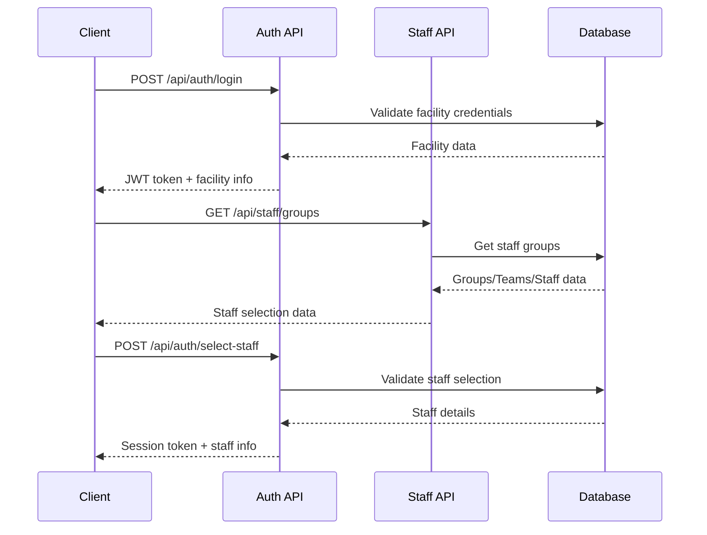

# ログイン API 設計書

## 概要
CareBase-staff ログインシステムのAPI設計書です。JWT ベースの認証システムを実装し、施設認証と職員選択の2段階認証を提供します。

## 技術スタック
- **フレームワーク**: Next.js 14 (App Router)
- **認証方式**: JWT (JSON Web Token)
- **バリデーション**: Zod
- **API スタイル**: REST API
- **データ形式**: JSON

## 認証フロー



## API エンドポイント

### 1. 施設認証

#### `POST /api/auth/login`

**概要**: 施設IDとパスワードで認証を行います。

**リクエスト**:
```typescript
{
  "facilityId": string,  // 施設ID（必須）
  "password": string     // パスワード（必須）
}
```

**レスポンス（成功）**:
```typescript
{
  "success": true,
  "token": string,        // JWT トークン
  "facilityId": string,   // 施設ID
  "facilityName": string, // 施設名
  "expiresAt": string,    // トークン有効期限 (ISO 8601)
  "message": "ログインに成功しました"
}
```

**レスポンス（失敗）**:
```typescript
{
  "success": false,
  "error": "INVALID_CREDENTIALS",
  "message": "施設IDまたはパスワードが正しくありません"
}
```

**ステータスコード**:
- `200`: 認証成功
- `401`: 認証失敗
- `422`: バリデーションエラー
- `500`: サーバーエラー

**実装例**:
```typescript
// app/api/auth/login/route.ts
import { NextRequest, NextResponse } from 'next/server';
import { z } from 'zod';
import jwt from 'jsonwebtoken';

const loginSchema = z.object({
  facilityId: z.string().min(1, '施設IDを入力してください'),
  password: z.string().min(1, 'パスワードを入力してください')
});

export async function POST(request: NextRequest) {
  try {
    const body = await request.json();
    const { facilityId, password } = loginSchema.parse(body);
    
    // 施設認証ロジック
    const facility = await validateFacility(facilityId, password);
    
    if (!facility) {
      return NextResponse.json(
        { 
          success: false, 
          error: 'INVALID_CREDENTIALS',
          message: '施設IDまたはパスワードが正しくありません' 
        },
        { status: 401 }
      );
    }
    
    // JWT トークン生成
    const token = jwt.sign(
      { facilityId, type: 'facility' },
      process.env.JWT_SECRET!,
      { expiresIn: '1h' }
    );
    
    return NextResponse.json({
      success: true,
      token,
      facilityId,
      facilityName: facility.name,
      expiresAt: new Date(Date.now() + 3600000).toISOString(),
      message: 'ログインに成功しました'
    });
    
  } catch (error) {
    if (error instanceof z.ZodError) {
      return NextResponse.json(
        { 
          success: false, 
          error: 'VALIDATION_ERROR',
          message: error.errors[0].message 
        },
        { status: 422 }
      );
    }
    
    return NextResponse.json(
      { 
        success: false, 
        error: 'SERVER_ERROR',
        message: 'サーバーエラーが発生しました' 
      },
      { status: 500 }
    );
  }
}
```

### 2. 職員データ取得

#### `GET /api/staff/groups`

**概要**: 認証済み施設の職員グループ・チーム・スタッフデータを取得します。

**ヘッダー**:
```
Authorization: Bearer <JWT_TOKEN>
```

**レスポンス（成功）**:
```typescript
{
  "success": true,
  "data": [
    {
      "id": string,
      "name": string,
      "description": string,
      "icon": string,
      "teams": [
        {
          "id": string,
          "name": string,
          "description": string,
          "icon": string,
          "staff": [
            {
              "id": string,
              "name": string,
              "furigana": string,
              "role": string,
              "employeeId": string,
              "isActive": boolean,
              "lastLogin": string | null
            }
          ]
        }
      ]
    }
  ]
}
```

**レスポンス（失敗）**:
```typescript
{
  "success": false,
  "error": "UNAUTHORIZED",
  "message": "認証が必要です"
}
```

**ステータスコード**:
- `200`: 取得成功
- `401`: 認証エラー
- `403`: 権限エラー
- `500`: サーバーエラー

**実装例**:
```typescript
// app/api/staff/groups/route.ts
import { NextRequest, NextResponse } from 'next/server';
import { verifyToken } from '@/lib/auth';
import { getStaffGroups } from '@/lib/database';

export async function GET(request: NextRequest) {
  try {
    const token = request.headers.get('Authorization')?.replace('Bearer ', '');
    
    if (!token) {
      return NextResponse.json(
        { 
          success: false, 
          error: 'UNAUTHORIZED',
          message: '認証が必要です' 
        },
        { status: 401 }
      );
    }
    
    const decoded = verifyToken(token);
    const groups = await getStaffGroups(decoded.facilityId);
    
    return NextResponse.json({
      success: true,
      data: groups
    });
    
  } catch (error) {
    return NextResponse.json(
      { 
        success: false, 
        error: 'SERVER_ERROR',
        message: 'サーバーエラーが発生しました' 
      },
      { status: 500 }
    );
  }
}
```

### 3. 職員選択・セッション確立

#### `POST /api/auth/select-staff`

**概要**: 選択された職員でセッションを確立します。

**ヘッダー**:
```
Authorization: Bearer <JWT_TOKEN>
```

**リクエスト**:
```typescript
{
  "staffId": string,  // 職員ID（必須）
  "groupId": string,  // グループID（必須）
  "teamId": string    // チームID（必須）
}
```

**レスポンス（成功）**:
```typescript
{
  "success": true,
  "sessionToken": string,  // セッション用JWTトークン
  "staff": {
    "id": string,
    "name": string,
    "furigana": string,
    "role": string,
    "employeeId": string,
    "group": {
      "id": string,
      "name": string
    },
    "team": {
      "id": string,
      "name": string
    }
  },
  "expiresAt": string,  // セッション有効期限
  "message": "職員選択が完了しました"
}
```

**レスポンス（失敗）**:
```typescript
{
  "success": false,
  "error": "STAFF_NOT_FOUND",
  "message": "指定された職員が見つかりません"
}
```

**ステータスコード**:
- `200`: 選択成功
- `400`: 無効なリクエスト
- `401`: 認証エラー
- `404`: 職員が見つからない
- `422`: バリデーションエラー
- `500`: サーバーエラー

**実装例**:
```typescript
// app/api/auth/select-staff/route.ts
import { NextRequest, NextResponse } from 'next/server';
import { z } from 'zod';
import jwt from 'jsonwebtoken';
import { verifyToken } from '@/lib/auth';
import { getStaffById, updateLastLogin } from '@/lib/database';

const selectStaffSchema = z.object({
  staffId: z.string().min(1, '職員IDが必要です'),
  groupId: z.string().min(1, 'グループIDが必要です'),
  teamId: z.string().min(1, 'チームIDが必要です')
});

export async function POST(request: NextRequest) {
  try {
    const token = request.headers.get('Authorization')?.replace('Bearer ', '');
    
    if (!token) {
      return NextResponse.json(
        { 
          success: false, 
          error: 'UNAUTHORIZED',
          message: '認証が必要です' 
        },
        { status: 401 }
      );
    }
    
    const decoded = verifyToken(token);
    const body = await request.json();
    const { staffId, groupId, teamId } = selectStaffSchema.parse(body);
    
    // 職員データ取得・検証
    const staff = await getStaffById(staffId, decoded.facilityId);
    
    if (!staff) {
      return NextResponse.json(
        { 
          success: false, 
          error: 'STAFF_NOT_FOUND',
          message: '指定された職員が見つかりません' 
        },
        { status: 404 }
      );
    }
    
    if (!staff.isActive) {
      return NextResponse.json(
        { 
          success: false, 
          error: 'STAFF_INACTIVE',
          message: '選択された職員は現在利用できません' 
        },
        { status: 400 }
      );
    }
    
    // セッショントークン生成
    const sessionToken = jwt.sign(
      { 
        facilityId: decoded.facilityId,
        staffId,
        groupId,
        teamId,
        type: 'session'
      },
      process.env.JWT_SECRET!,
      { expiresIn: '8h' }
    );
    
    // 最終ログイン時間更新
    await updateLastLogin(staffId);
    
    return NextResponse.json({
      success: true,
      sessionToken,
      staff: {
        id: staff.id,
        name: staff.name,
        furigana: staff.furigana,
        role: staff.role,
        employeeId: staff.employeeId,
        group: {
          id: groupId,
          name: staff.group.name
        },
        team: {
          id: teamId,
          name: staff.team.name
        }
      },
      expiresAt: new Date(Date.now() + 28800000).toISOString(), // 8時間後
      message: '職員選択が完了しました'
    });
    
  } catch (error) {
    if (error instanceof z.ZodError) {
      return NextResponse.json(
        { 
          success: false, 
          error: 'VALIDATION_ERROR',
          message: error.errors[0].message 
        },
        { status: 422 }
      );
    }
    
    return NextResponse.json(
      { 
        success: false, 
        error: 'SERVER_ERROR',
        message: 'サーバーエラーが発生しました' 
      },
      { status: 500 }
    );
  }
}
```

### 4. セッション検証

#### `GET /api/auth/session`

**概要**: 現在のセッションを検証し、ユーザー情報を取得します。

**ヘッダー**:
```
Authorization: Bearer <SESSION_TOKEN>
```

**レスポンス（成功）**:
```typescript
{
  "success": true,
  "user": {
    "staffId": string,
    "name": string,
    "role": string,
    "facilityId": string,
    "groupId": string,
    "teamId": string
  },
  "expiresAt": string
}
```

**レスポンス（失敗）**:
```typescript
{
  "success": false,
  "error": "INVALID_SESSION",
  "message": "セッションが無効です"
}
```

### 5. ログアウト

#### `POST /api/auth/logout`

**概要**: セッションを無効化してログアウトします。

**ヘッダー**:
```
Authorization: Bearer <SESSION_TOKEN>
```

**レスポンス（成功）**:
```typescript
{
  "success": true,
  "message": "ログアウトしました"
}
```

## エラーハンドリング

### エラーコード一覧
- `INVALID_CREDENTIALS`: 認証情報が無効
- `UNAUTHORIZED`: 認証が必要
- `FORBIDDEN`: 権限がない
- `VALIDATION_ERROR`: バリデーションエラー
- `STAFF_NOT_FOUND`: 職員が見つからない
- `STAFF_INACTIVE`: 職員が無効
- `INVALID_SESSION`: セッションが無効
- `SERVER_ERROR`: サーバーエラー

### 共通エラーレスポンス形式
```typescript
{
  "success": false,
  "error": string,        // エラーコード
  "message": string,      // エラーメッセージ
  "details"?: any        // 詳細情報（オプション）
}
```

## セキュリティ

### JWT トークン仕様
- **アルゴリズム**: HS256
- **有効期限**: 
  - 施設認証トークン: 1時間
  - セッショントークン: 8時間
- **ペイロード**: 
  ```typescript
  {
    "facilityId": string,
    "staffId"?: string,
    "groupId"?: string,
    "teamId"?: string,
    "type": "facility" | "session",
    "iat": number,
    "exp": number
  }
  ```

### セキュリティ対策
- **パスワード暗号化**: bcrypt による暗号化
- **トークン検証**: すべてのAPIでJWT検証
- **レート制限**: ログイン試行回数の制限
- **HTTPS通信**: プロダクション環境では必須
- **CORS設定**: 適切なオリジン制限

## データベース設計

### テーブル構造

#### facilities テーブル
```sql
CREATE TABLE facilities (
  id VARCHAR(50) PRIMARY KEY,
  name VARCHAR(100) NOT NULL,
  password_hash VARCHAR(255) NOT NULL,
  is_active BOOLEAN DEFAULT TRUE,
  created_at TIMESTAMP DEFAULT CURRENT_TIMESTAMP,
  updated_at TIMESTAMP DEFAULT CURRENT_TIMESTAMP ON UPDATE CURRENT_TIMESTAMP
);
```

#### staff_groups テーブル
```sql
CREATE TABLE staff_groups (
  id VARCHAR(50) PRIMARY KEY,
  facility_id VARCHAR(50) NOT NULL,
  name VARCHAR(100) NOT NULL,
  description TEXT,
  icon VARCHAR(50),
  created_at TIMESTAMP DEFAULT CURRENT_TIMESTAMP,
  FOREIGN KEY (facility_id) REFERENCES facilities(id)
);
```

#### staff_teams テーブル
```sql
CREATE TABLE staff_teams (
  id VARCHAR(50) PRIMARY KEY,
  group_id VARCHAR(50) NOT NULL,
  name VARCHAR(100) NOT NULL,
  description TEXT,
  icon VARCHAR(50),
  created_at TIMESTAMP DEFAULT CURRENT_TIMESTAMP,
  FOREIGN KEY (group_id) REFERENCES staff_groups(id)
);
```

#### staff テーブル
```sql
CREATE TABLE staff (
  id VARCHAR(50) PRIMARY KEY,
  team_id VARCHAR(50) NOT NULL,
  name VARCHAR(100) NOT NULL,
  furigana VARCHAR(100) NOT NULL,
  role VARCHAR(50) NOT NULL,
  employee_id VARCHAR(50) NOT NULL,
  is_active BOOLEAN DEFAULT TRUE,
  last_login TIMESTAMP NULL,
  created_at TIMESTAMP DEFAULT CURRENT_TIMESTAMP,
  updated_at TIMESTAMP DEFAULT CURRENT_TIMESTAMP ON UPDATE CURRENT_TIMESTAMP,
  FOREIGN KEY (team_id) REFERENCES staff_teams(id)
);
```

## モック実装

### 現在のモック認証
```typescript
// app/(auth)/login/page.tsx
const handleLogin = async (credentials: {
  facilityId: string;
  password: string;
}): Promise<boolean> => {
  // モック認証ロジック
  if (credentials.facilityId === 'admin' && credentials.password === 'password') {
    return true;
  }
  return false;
};
```

### モックデータ
```typescript
// mocks/staff-data.ts
export const mockStaffGroups = [
  {
    id: 'group-1',
    name: '介護フロア A',
    description: '1階 介護フロア',
    icon: Heart,
    teams: [
      {
        id: 'team-1',
        name: '夜勤チーム',
        description: '夜間担当',
        icon: Moon,
        staff: [
          {
            id: 'staff-1',
            name: '田中 花子',
            furigana: 'タナカ ハナコ',
            role: '主任看護師',
            employeeId: 'EMP001',
            isActive: true
          }
        ]
      }
    ]
  }
];
```

## 実装予定

### Phase 1: 基本実装
- [x] モック認証システム
- [x] JWT トークン実装
- [x] 基本的なエラーハンドリング

### Phase 2: セキュリティ強化
- [ ] パスワード暗号化
- [ ] レート制限
- [ ] セッション管理
- [ ] CSRF対策

### Phase 3: 機能拡張
- [ ] パスワード変更機能
- [ ] ログイン履歴
- [ ] 二要素認証
- [ ] 自動ログアウト

## テスト

### API テスト例
```typescript
// __tests__/api/auth/login.test.ts
import { POST } from '@/app/api/auth/login/route';
import { NextRequest } from 'next/server';

describe('/api/auth/login', () => {
  it('should return JWT token on successful login', async () => {
    const request = new NextRequest('http://localhost:3000/api/auth/login', {
      method: 'POST',
      body: JSON.stringify({
        facilityId: 'admin',
        password: 'password'
      })
    });
    
    const response = await POST(request);
    const data = await response.json();
    
    expect(response.status).toBe(200);
    expect(data.success).toBe(true);
    expect(data.token).toBeDefined();
  });
  
  it('should return 401 on invalid credentials', async () => {
    const request = new NextRequest('http://localhost:3000/api/auth/login', {
      method: 'POST',
      body: JSON.stringify({
        facilityId: 'wrong',
        password: 'wrong'
      })
    });
    
    const response = await POST(request);
    const data = await response.json();
    
    expect(response.status).toBe(401);
    expect(data.success).toBe(false);
  });
});
```

## 参考資料
- [Next.js API Routes](https://nextjs.org/docs/app/building-your-application/routing/router-handlers)
- [JWT (JSON Web Tokens)](https://jwt.io/)
- [Zod Validation](https://zod.dev/)
- [bcrypt Password Hashing](https://www.npmjs.com/package/bcrypt)